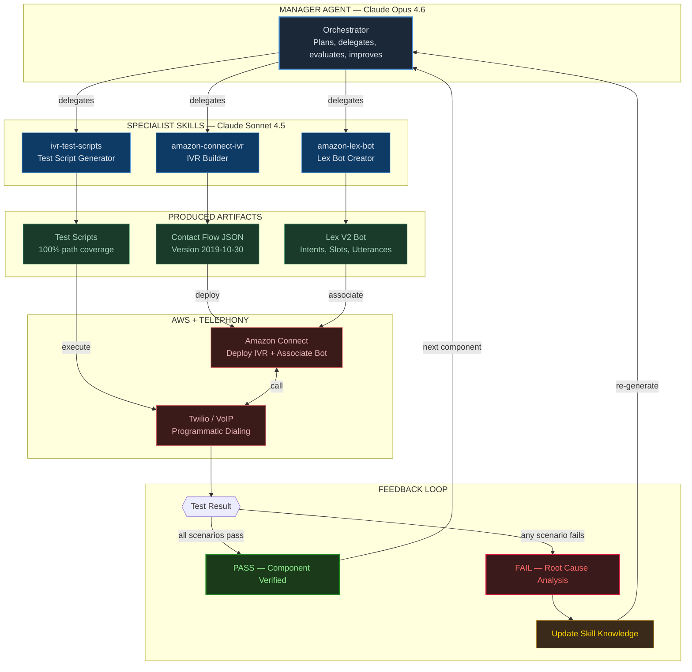
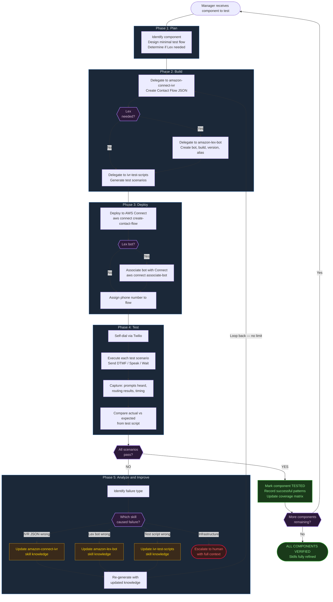
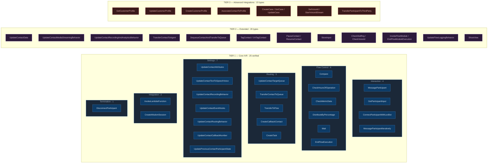
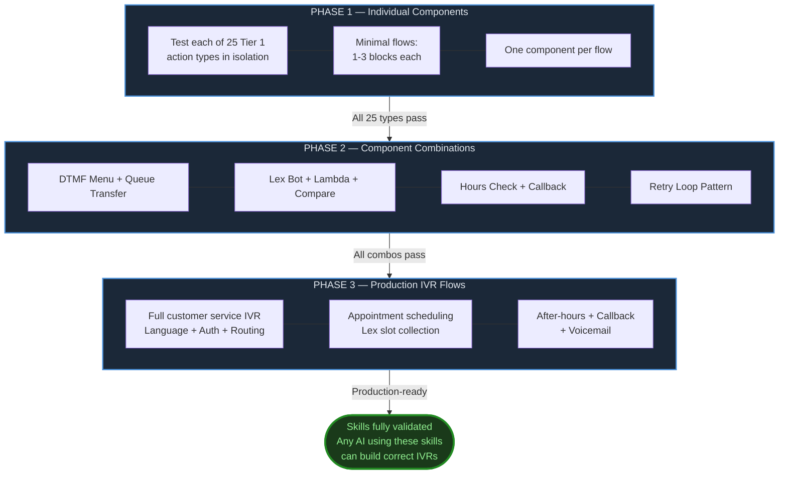

# IVR AI Organization — Architecture Diagrams

---

## 1. Organization Structure

---

## 2. Self-Improving Loop (No Max Attempts)

---

## 3. Component Test Coverage — All 60 Action Types

---

## 4. Concrete Example — Testing GetParticipantInput

```mermaid
sequenceDiagram
    autonumber

    participant MGR as Manager Agent<br/>Claude Opus 4.6
    participant IVR as IVR Builder<br/>amazon-connect-ivr
    participant TST as Test Generator<br/>ivr-test-scripts
    participant AWS as Amazon Connect
    participant TEL as Twilio

    Note over MGR: Component: GetParticipantInput<br/>Goal: Verify DTMF menu routing

    rect rgb(13, 59, 102)
        Note right of MGR: BUILD PHASE
        MGR->>IVR: Create minimal flow:<br/>Prompt + GetParticipantInput (1=Sales, 2=Support)<br/>+ branch confirmations + disconnect
        IVR-->>MGR: Contact Flow JSON
        Note over MGR: Lex not needed for DTMF-only test
        MGR->>TST: Generate test script:<br/>S1: Press 1 -> hear sales<br/>S2: Press 2 -> hear support<br/>S3: Press 9 -> hear error<br/>S4: Silence -> hear timeout
        TST-->>MGR: Test Script (4 scenarios)
    end

    rect rgb(58, 26, 26)
        Note right of MGR: DEPLOY PHASE
        MGR->>AWS: aws connect create-contact-flow<br/>--content flow.json
        AWS-->>MGR: Flow ID + Phone Number
    end

    rect rgb(26, 58, 26)
        Note right of MGR: TEST PHASE
        loop Until all 4 scenarios pass
            MGR->>TEL: Dial +1-XXX-XXX-XXXX
            TEL->>AWS: Inbound call
            AWS-->>TEL: Press 1 for sales. Press 2 for support.
            TEL->>AWS: DTMF digit
            AWS-->>TEL: Branch confirmation prompt
            TEL-->>MGR: Actual result
            MGR->>MGR: Compare actual vs expected

            alt ALL PASS
                Note over MGR: Mark GetParticipantInput as TESTED
            else ANY FAIL
                MGR->>MGR: Analyze: which skill caused failure?
                alt IVR JSON issue
                    MGR->>IVR: Update skill: fix parameter/transition
                    IVR-->>MGR: Updated Contact Flow JSON
                else Test script issue
                    MGR->>TST: Update skill: fix timing/expectations
                    TST-->>MGR: Updated Test Script
                end
                MGR->>AWS: Re-deploy updated flow
                Note over MGR: Loop continues — no max attempts
            end
        end
    end

    MGR->>MGR: Update coverage matrix<br/>Move to next component
```

---

## 5. Test Progression Phases

